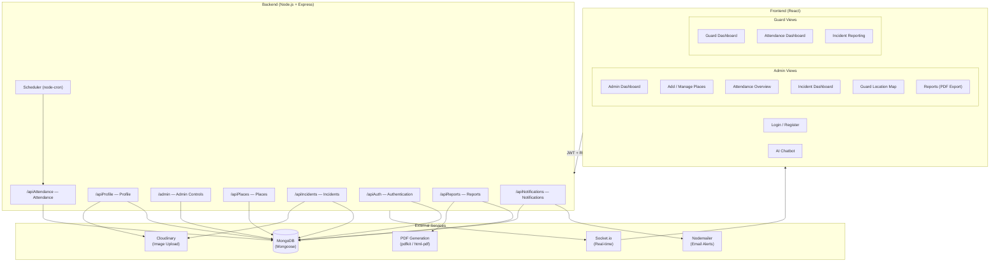

# 🛡️ Security Guard Management System

A full-stack web application to manage security guard operations — including attendance tracking, incident reporting, location monitoring, shift scheduling, and real-time notifications — with separate dashboards for **Admins** and **Guards**.

---

## 🏗️ Architecture



---

## ✨ Features

### 🛡️ Guard Features
- **Guard Dashboard** — View assigned shifts, schedule, and location check-ins
- **Attendance Tracking** — Clock-in/out with location verification
- **Incident Reporting** — Log incidents with description, photo upload (Cloudinary), and severity
- **AI Chatbot** — In-app chatbot for quick queries about duties and procedures

### 🔧 Admin Features
- **Admin Dashboard** — Full overview of guards, places, attendance, and incidents
- **Place Management** — Add and configure guard posts/locations with geo-data
- **Attendance Overview** — Monitor all guards' attendance records; export reports
- **Incident Dashboard** — Review, manage, and respond to all reported incidents
- **Guard Location Map** — Live map view of guard locations
- **Report Generation** — Generate and download PDF reports
- **Push Notifications** — In-app notifications stored in MongoDB
- **Scheduled Jobs** — Automated attendance reminders via `node-cron`

### 🔐 Authentication & Security
- JWT-based authentication (`jsonwebtoken`)
- Password hashing with `bcrypt`
- Passport.js middleware (local & JWT strategies)
- Role-based access: **Admin** vs **Guard**

---

## 🛠️ Tech Stack

### Frontend
| Tool | Purpose |
|---|---|
| React (CRA) | UI framework |
| React Router | Client-side routing |
| Axios | HTTP API calls |
| Socket.io Client | Real-time updates |

### Backend
| Tool | Purpose |
|---|---|
| Node.js + Express | REST API server |
| Mongoose + MongoDB | Database ORM + storage |
| Cloudinary | Image upload & storage |
| Nodemailer | Email alerts |
| Socket.io | Real-time communication |
| jsonwebtoken + Passport | Auth & authorization |
| node-cron | Scheduled tasks |
| pdfkit / html-pdf | PDF report generation |
| multer | File upload handling |

---

## 📁 Project Structure

```
security-guard/
├── backend/
│   ├── models/
│   │   ├── User.js          # Guard/Admin user model
│   │   ├── Attendance.js    # Attendance records
│   │   ├── Incident.js      # Incident reports
│   │   ├── Notification.js  # Notification records
│   │   ├── Place.js         # Guard post/location model
│   │   └── location.js      # Live location tracking
│   ├── routes/
│   │   ├── auth.js          # Login, register, JWT
│   │   ├── profile.js       # Profile update, photo upload
│   │   ├── admin.js         # Admin controls
│   │   ├── places.js        # Place CRUD
│   │   ├── incidents.js     # Incident CRUD + photo
│   │   ├── attendances.js   # Check-in/out, attendance logs
│   │   ├── reports.js       # PDF report generation
│   │   ├── notifications.js # Firebase + email alerts
│   │   ├── scheduler.js     # Cron jobs
│   │   └── locations.js     # Live location updates
│   ├── middleware/          # Auth middleware (JWT verify)
│   └── server.js            # Express app entry point
├── frontend/
│   └── src/
│       ├── Admin/
│       │   ├── AdminDashboard.js
│       │   ├── AdminAttendance.js
│       │   ├── AdminIncidentDashboard.js
│       │   ├── AddPlacePage.js
│       │   ├── GuardLocationMap.js
│       │   └── Report.js
│       ├── Guard/
│       │   ├── GuardDashboard.js
│       │   ├── AttendanceDashboard.js
│       │   └── IncidentDashboard.js
│       ├── Chatbot/
│       │   ├── Chatbot.jsx
│       │   └── securitySystem.js
│       ├── components/      # Shared UI components
│       └── App.js           # Routes & role-based rendering
└── README.md
```

---

## 🚀 Getting Started

### Prerequisites
- [Node.js](https://nodejs.org/) v16+
- [MongoDB](https://www.mongodb.com/) (local or Atlas)
- [Yarn](https://yarnpkg.com/)

### Backend Setup

```bash
cd backend
yarn install
```

Create a `.env` file in `backend/`:
```env
MONGO_URI=your_mongodb_connection_string
JWT_SECRET=your_jwt_secret
CLOUDINARY_CLOUD_NAME=your_cloudinary_name
CLOUDINARY_API_KEY=your_cloudinary_key
CLOUDINARY_API_SECRET=your_cloudinary_secret
EMAIL_USER=your_email@gmail.com
EMAIL_PASS=your_email_password

PORT=5000
```

Run the server:
```bash
# Development
yarn dev

# Production
yarn start
```

API runs at: `http://localhost:5000`

### Frontend Setup

```bash
cd frontend
yarn install
yarn start
```

App runs at: `http://localhost:3000`

---

## 🔌 API Endpoints Overview

| Route Prefix | Description |
|---|---|
| `/apiAuth` | Login, register, token management |
| `/apiProfile` | View & update guard/admin profile, photo upload |
| `/admin` | Admin-only user and system management |
| `/apiPlaces` | Create, update, delete guard posts |
| `/apiIncidents` | Report and manage security incidents |
| `/apiAttendance` | Clock-in/out, attendance history |
| `/apiReports` | Generate and download PDF reports |
| `/apiNotifications` | Send push + email notifications |

---

## 📄 License

MIT License — see [LICENSE](LICENSE)
